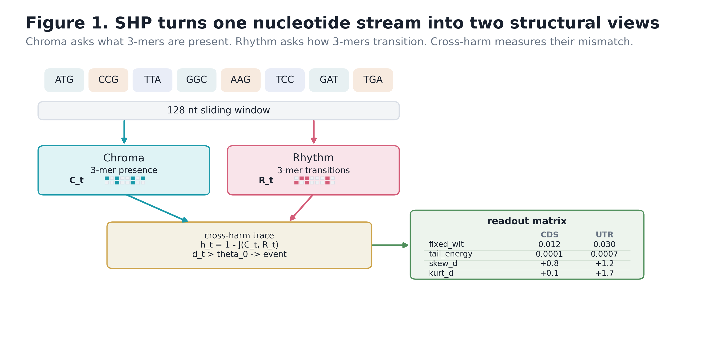
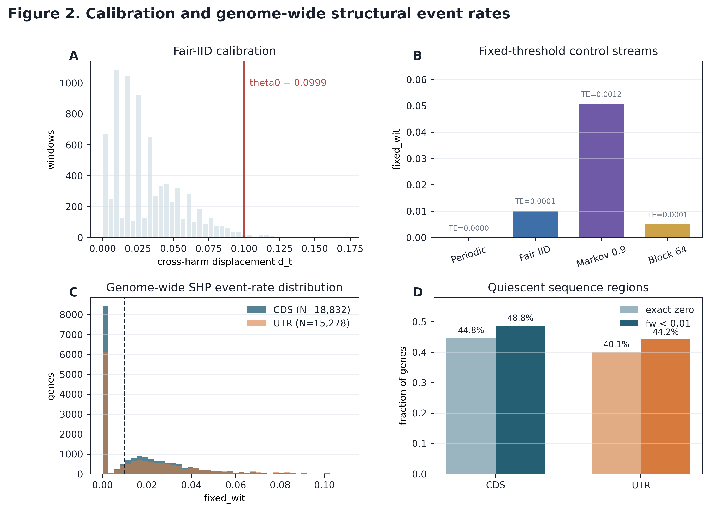
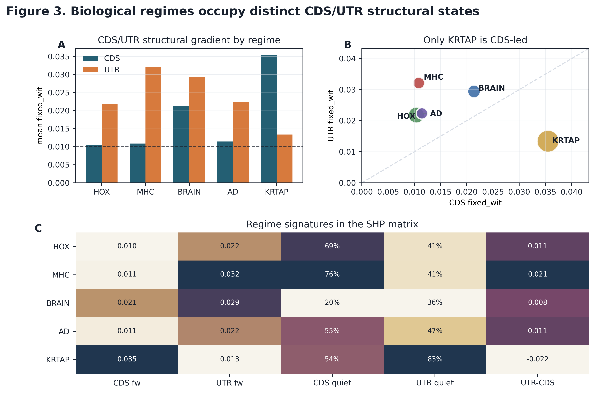
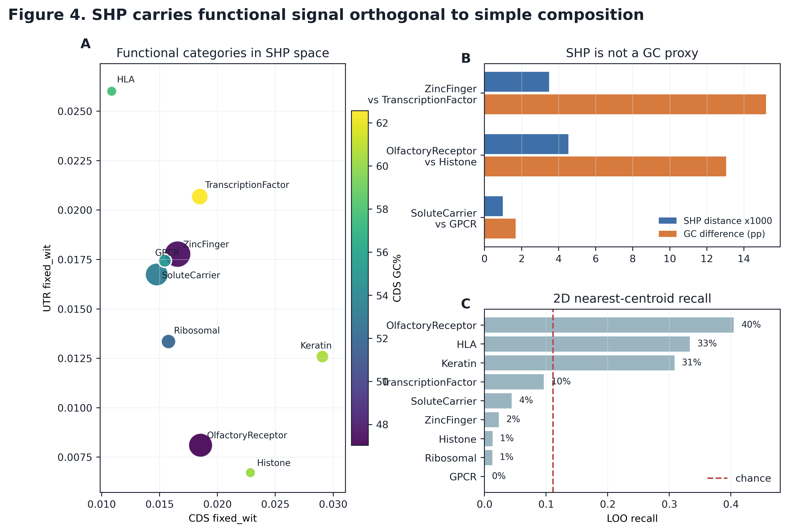

# SHP

SHP is a zero-training structural readout for symbolic biological sequences.

It compares two orthogonal views of the same local sequence window:

- `chroma`: which local k-mers are present.
- `rhythm`: which adjacent k-mer transitions are present.

The Jaccard distance between these two views forms a local cross-harm trace.
Abrupt changes in that trace, measured against a fixed fair-IID calibration
threshold, define structural events.

This repository contains the standalone SHP instrument and the first
GeneGrammar case-study assets.

## Quick Start

```powershell
cd G:\SHP
python -m pip install -e .
shp scan --fasta data\demo.fa --out results\demo_scan.tsv
```

Without installation:

```powershell
cd G:\SHP
$env:PYTHONPATH = "src"
python -m shp scan --fasta data\demo.fa --out results\demo_scan.tsv
```

The output is a TSV table with one row per FASTA record:

```text
record_id	length	n_windows	n_transitions	mean_h	mean_d	fixed_wit	tail_energy	skew_d	kurt_d
```

A checked example output is included at `results/demo_scan.tsv`.

### Performance

On a single core, SHP processes approximately 10,000 nucleotides in 70 ms
(~140 kbp/s). The full human protein-coding genome (19,491 genes) scans in
about 100 minutes on one core. Use `--workers N` for parallel scanning.

### Other Commands

```powershell
shp calibrate                          # calibrate theta0 from fair IID streams
shp scan --fasta in.fa --shuffle 10    # also compute 10 dinucleotide-null copies per record
shp scan --fasta in.fa --workers 4     # scan with 4 parallel workers
```

## What SHP Measures

Default DNA setting:

- alphabet: `A/C/G/T`
- n-gram: `3`
- hash dimension: `64`
- window: `128 nt`
- stride: `window // 5`
- threshold: `theta0 = 0.0999`

`fixed_wit` is the fraction of consecutive windows whose cross-harm displacement
exceeds the calibrated threshold. `tail_energy` adds event magnitude by averaging
the excess above that threshold.

SHP is intended as a first-pass structural spectroscopy coordinate. It is not a
diagnostic classifier and does not use biological labels during feature
construction. Labels enter only after scanning, for interpretation and validation.

## GeneGrammar Case Study

The included paper assets document an initial genome-scale case study:

- 19,491 genes
- 224,518 transcripts
- CDS and UTR structural spectra
- functional regime contrasts, including HLA, keratin, histone, ribosomal,
  heat-shock, transcription factor, zinc-finger, transporter, and receptor groups

The full matrix is not bundled in this repository yet. A small sample matrix is
included at `data/gene_matrix_sample.csv`; release-scale matrices should be
distributed through a tagged release or Zenodo record.

## Figures









Captions are in `paper/figure_captions.md`.

## Repository Map

- `src/shp/`: minimal SHP implementation and CLI.
- `data/demo.fa`: runnable toy FASTA.
- `data/gene_matrix_sample.csv`: compact sample from the GeneGrammar matrix.
- `results/`: calibration summaries and example output.
- `paper/preprint_v1.md`: current SHP/GeneGrammar preprint draft.
- `paper/figures/`: publication-oriented PNG/PDF/SVG figures.
- `paper/scripts/make_paper_figures.py`: figure generation script.
- `docs/METHOD.md`: method notes and interpretation cautions.
- `docs/DATA.md`: data and release notes.
- `docs/REPRODUCIBILITY.md`: local checks and publication-level controls.

## Open Discussion

This project is open to biological review, replication, and method criticism.
Useful feedback includes matched-null design, transcript/isoform FASTA tests,
region set definitions, and functional interpretation of structural outliers.

Contact: jackey.l.gene@outlook.com

## License

MIT.
